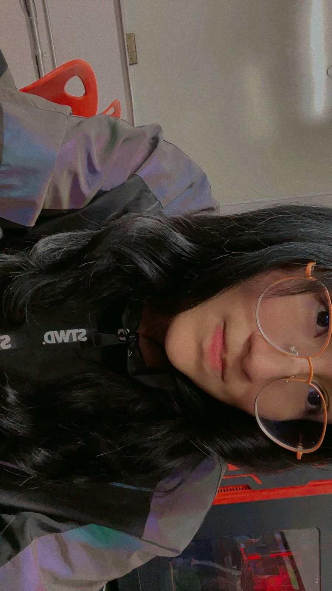

# Integrantes del grupo _3DEV_ de la asignatura Programación en Lenguajes Interpretados

## Profesor

### Jonathan MirCha

Hola soy tu amigo y docente digital... Jonathan Mircha

- [jmiranda@amerike.edu.mx](jmiranda@amerike.edu.mx)
- [_@jonmircha_](https://github.com/jonmircha)
  

---

## Estudiantes

### Celeste Elisheba Bautista Altamirano

Soy Celeste, aunque me gusta que me digan Eli, tengo 20 años, me gustan los videojuegos y el anime, mi anime favorito es Servamp y mi juego favorito actualmente es Lies of P

-[cdmx2983@amerike.edu.mx](cdmx2983@amerike.edu.mx)
-[elichaosx](https://github.com/elichaosx)

