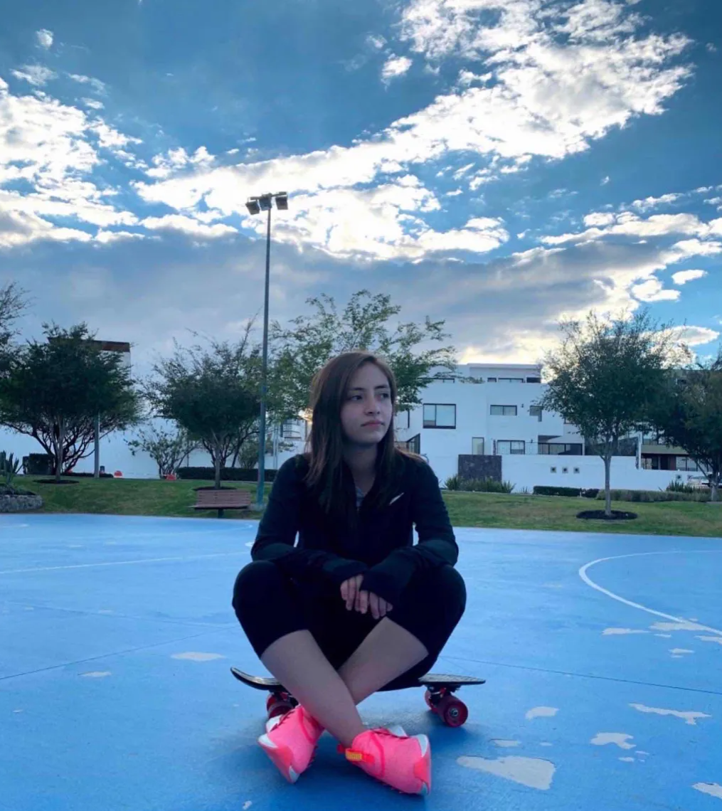
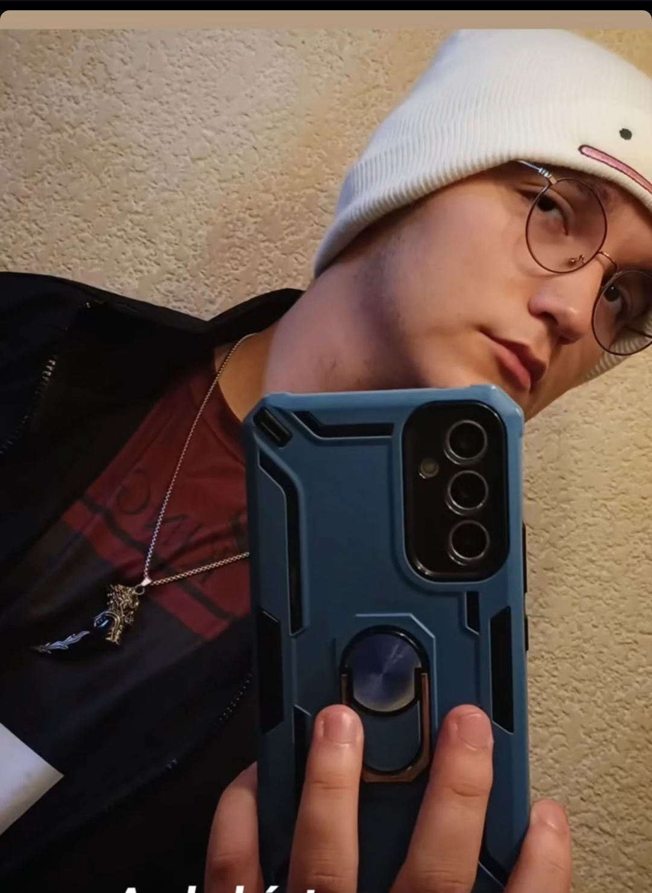
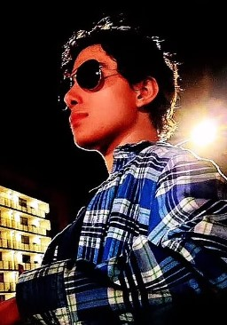
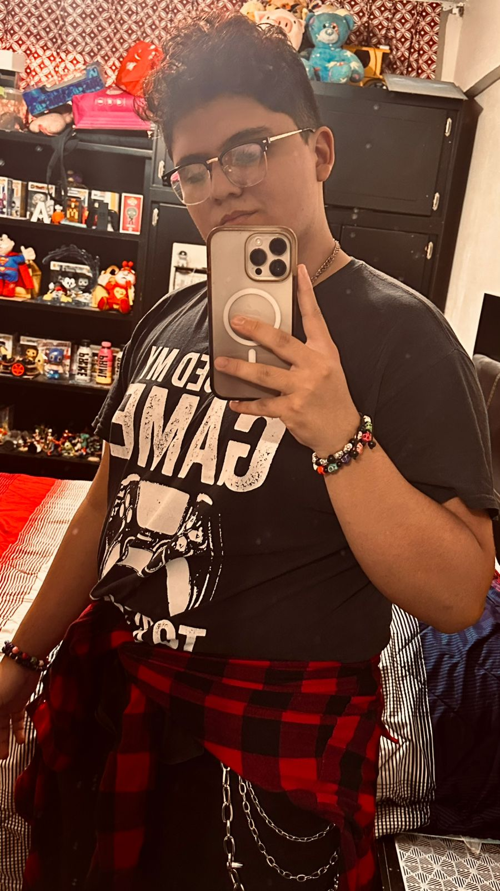

# Integrantes del grupo _3DEV_ de la asignatura Programación en Lenguajes Interpretados

## Profesor

### Jonathan MirCha

Hola soy tu amigo y docente digital... Jonathan Mircha

- [jmiranda@amerike.edu.mx](jmiranda@amerike.edu.mx)
- [_@jonmircha_](https://github.com/jonmircha)
  

---

## Estudiantes

### Giselle Gallegos Ramos

Soy Giselle, Estudio en Amerike, me gustan los videojuegos y programar paginas web

-[cdmx3070@amerike.edu.mx](cdmx3070@amerike.edu.mx)
-[Perfil git](https://github.com/GiGifgr)

### Felipe Cortés Vázquez Gargallo
 
Guapo , sexy , filantropo y humilde es como me describen algunos, aunque a mi me gusta verme como un inversionista a largo plazo. Estudiante en Amerike. Amentes de las mentirosas.
 
- [correo](cdmx2984@amerike.edu.mx) 
   - [Mi perfil](https://github.com/Crow1341) 
 
 
 
--- 

### Santiago Guillermo Oropeza Reyes 
 
Soy un estdiante en la Universidad Amerike en la carrera de desarrollo de videojuegos
 
- [correoamerike](cdmx2939@amerike.edu.mx) 
- [GitHub](https://github.com/JulioRegalado) 
 

 
---

###  Emiliano Sánchez Celis 

Un breve párrafo de presentación sobre quien eres
- [tucorreo@amerike.edu.mx](cdmx3107@amerike.edu.mx)
- [Emi_Celis](https://github.com/EmiCelis)

---

### Rogelio Angel Hugo Sanchez Camacho

Me gustan que me llamen Roger, me gusta el color rojo, mi videojuego favoirto es Minecraft y soy developer de tercer semestre.

- [cdmx3073@amerike.edu.mx](cdmx3073@amerike.edu.mx)
- [_@RogelioAMERIKE_](https://github.com/RogelioAMERIKE)

---

 ### Patricio Fuentes Silva
 
   Soy Patricio Fuentes estudiante de Amerike en la carrera de Desarrollo de Software Interactivo y de Videojuegos y estoy en el tercer semestre.
 
   - [cdmx3029@amerike.edu.mx](cdmx3029@amerike.edu.mx) 
   - [SoyPatu](https://github.com/SoyPatu) 
 
 
    
 
   ---