# Juego Piedra, Papel o Tijeras

El juego de **Piedra, Papel o Tijeras** es un clásico juego de manos en el que existen tres elementos:

- La piedra 🪨, que vence a la tijera rompiéndola,
- La tijera ✂️, que vence al papel cortándolo, y
- El papel 📄, que vence a la piedra envolviéndola.

Este juego milenario combina estrategia, azar y sencillez, siendo usado en todo el mundo para tomar decisiones rápidas y justas entre dos personas desde hace siglos.

## Historia

- Este juego fue inventado originalmente en **China** hace aproximadamente dos milenios, durante la dinastía _Han_ (_206 a.C. - 220 d.C._).
- La primera mención de un juego parecido aparece en el libro _**Wǔzázǔ**_ (五雜俎) escrito por _Xiè Zhàozhì_ al final de la era _Ming_.
- En sus orígenes, el juego tenía símbolos diferentes que representaban animales como la serpiente, la rana y el ciempiés venenoso, cada uno dominando a otro en un ciclo cerrado.
- El juego llegó a **Japón** en el _siglo XVII_, donde fue adaptado y popularizado bajo diversas formas, incluyendo la variante conocida como _**jan-ken**_ o _**jankenpon**_, que usa las manos para representar piedra, papel o tijeras.
- En Japón, el juego tenía relación con las artes marciales, donde cada gesto simbolizaba diferentes ataques y defensas.
- Con el contacto entre Japón y occidente a finales del _siglo XIX_ y principios del _XX_, **Piedra, Papel o Tijeras** se difundió globalmente.
- A partir de entonces, se popularizó como un método simple y justo para decidir entre dos personas quién tomaría una acción, semejante al lanzamiento de una moneda.

## Curiosodades

- En Japón, Perú, Brasil y otros países se le conoce como _**jankenpon**_ o variantes como _hakembo_.
- En México se le llama comúnmente **piedra, papel o tijera**, aunque en algunas regiones tienen nombres coloquiales como _**chin chan pú**_ o _**pikachú**_.
- En Corea del Sur se le denomina _**gawi-bawi-bo**_ (tijera, piedra, papel).
- En Francia es conocido como _**chi-fou-mi**_, derivado de palabras japonesas antiguas.
- El juego ha sido objeto de estudios matemáticos y psicológicos para comprender las estrategias óptimas, a pesar de su aparente simplicidad.
- Se ha convertido en una actividad tan popular que existen competiciones nacionales e internacionales, con premios económicos.

## Videojuego

El videojuego consiste en que el usuario elige una opción entre piedra, papel o tijeras, y la computadora elige aleatoriamente otra opción. El resultado se decide según las reglas del juego:

- Piedra gana a tijeras.
- Tijeras gana a papel.
- Papel gana a piedra.

## Algoritmo

1. Inicion el Juego.
1. Mostrar al jugador las opciones: piedra, papel o tijeras.
1. Esperar la elección del jugador y guardarla.
1. Generar aleatoriamente una opción para la computadora y guardarla.
1. Comparar la decisión del jugador contra la de la computadora:
   - Si son iguales, el resultado es **Empate**.
   - Si no son iguales, aplicar las reglas de victoria:
     - Piedra gana a tijeras.
     - Tijeras gana a papel.
     - Papel gana a piedra.
1. Mostrar el resultado al jugador:
   - Si ganó el jugador, mostrar: **"¡Ganaste!"**.
   - Si ganó la computadora, mostrar: **"¡Perdiste!"**.
   - Si empataron, mostrar **"¡Empate!"**.
1. Fin del juego.

## Diagrama de Flujo

